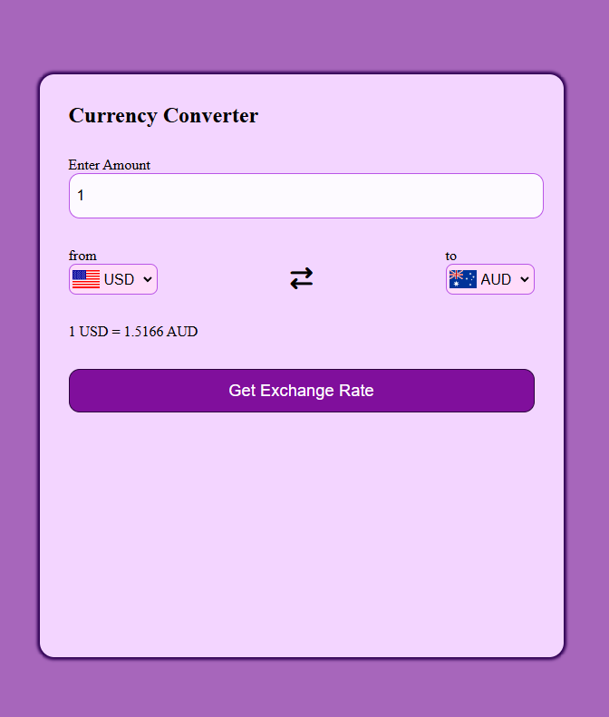

# 💱 Currency Converter

A responsive **Currency Converter Web App** built with **HTML, CSS, and JavaScript**.  
It uses the **ExchangeRate API** to fetch live exchange rates and lets you convert between currencies with real-time flag updates.

---

## 📸 Preview

## 

## ✨ Features

- 🔄 Convert between 100+ world currencies.
- 🌍 Dynamic country flags update when you change currency.
- 📊 Live exchange rates fetched via [ExchangeRate API](https://www.exchangerate-api.com/).
- 📱 Responsive design for desktop and mobile.
- 🎨 Clean and modern UI with smooth dropdown interaction.

---

## 🛠️ Tech Stack

- **HTML5** – Base structure.
- **CSS3** – Styling and responsive design.
- **JavaScript (Vanilla JS)** – API integration & conversion logic.
- **ExchangeRate API** – For fetching live currency data.
- **FlagsAPI** – For displaying currency flags.

---

## 📂 Project Structure

```bash
.
├── index.html             # Main page
├── /CSS
│   └── style.css          # App styling
├── /JavaScript
│   ├── country.js          # Country & currency list mapping
│   └── function.js        # Conversion logic and API fetch
├── /image                 # (Optional) Add preview or assets
└── README.md              # Documentation

```

## 📖 How to Use

Enter the amount you want to convert.

Choose the From Currency and To Currency using the dropdown menus.

Click on Get Exchange Rate.

Instantly see the converted value with updated flags and accurate rates.

## 🔮 Possible Improvements (Future Enhancements)

✅ Add a historical exchange rate chart (using Chart.js or D3).

✅ Add a "swap currencies" button for quick switching.

✅ Store conversion history locally for quick access.

✅ Multi-language support.

✅ Offline mode with cached exchange rates.
